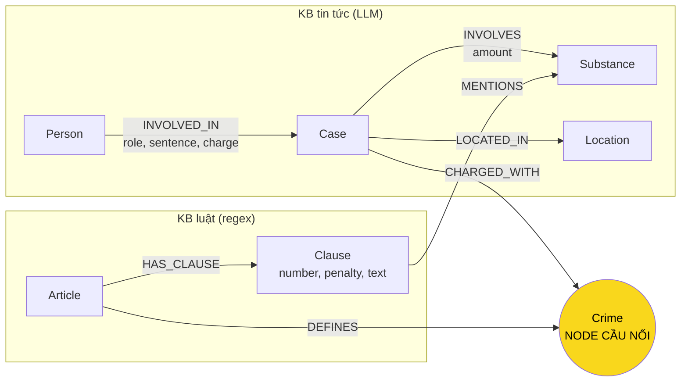

# Thiết kế Ontology — Day 19

**Họ tên:** Vũ Việt Hoàng  **MSSV:** 2A202602398

**Lựa chọn** (đánh dấu một):
- [x] Dùng ontology gợi ý (có thể chỉnh nhỏ)
- [ ] Tự thiết kế (xét bonus +15, xem `SUBMISSION.md`)

> Bản này mô tả đúng những gì `build_graph` trong `src/graph.py` ghi vào Neo4j. Sau khi chạy `python bench_kg.py --build`, đối chiếu bằng `MATCH (n) RETURN DISTINCT labels(n)` và `MATCH ()-[r]->() RETURN DISTINCT type(r)` (7 label, 7 loại quan hệ).

## 1. Sơ đồ

## 2. Entity types (node labels)

| Label | Ý nghĩa | Khóa định danh (`MERGE` theo) | Properties | Lấy từ KB nào | Trích bằng |
| --- | --- | --- | --- | --- | --- |
| `Article` | Một Điều luật | `id` ("Điều 251 BLHS") | title, law, doc_id | Luật | regex (`parse_law_article`) |
| `Clause` | Một khoản của Điều | `id` ("Điều 251 BLHS khoản 1") | number, penalty, text, doc_id | Luật | regex |
| `Crime` | Tội danh (đã chuẩn hóa) | `name` ("mua bán trái phép chất ma túy") | name | Luật (tiêu đề Điều); tin liên kết vào | regex + `link_entity` |
| `Substance` | Chất ma túy | `name` (tên chuẩn trong `SUBSTANCES`) | name | Cả hai | `find_substances` (luật), LLM (tin) |
| `Case` | Một vụ việc trong bài báo | `name` (LLM đặt) | summary, date, source_title, doc_id | Tin | LLM |
| `Person` | Bị cáo / nghi phạm / người liên quan | `name` | aliases | Tin | LLM |
| `Location` | Tỉnh / thành phố | `name` | name | Tin | LLM |

`Crime`, `Substance`, `Person`, `Location` không có `doc_id` vì là node dùng chung giữa nhiều tài liệu (hợp lệ theo LAB_GUIDE Bước 4).

## 3. Relationships

| Type | Từ → Đến | Properties trên cạnh | Ý nghĩa |
| --- | --- | --- | --- |
| `DEFINES` | Article → Crime | | Điều luật định nghĩa tội danh |
| `HAS_CLAUSE` | Article → Clause | | Điều gồm các khoản |
| `MENTIONS` | Clause → Substance | | Khoản nhắc tới chất (khung khối lượng) |
| `CHARGED_WITH` | Case → Crime | | Vụ án bị truy tố tội danh này |
| `INVOLVES` | Case → Substance | amount | Vụ án liên quan chất nào, khối lượng bao nhiêu |
| `LOCATED_IN` | Case → Location | | Nơi xảy ra / xét xử |
| `INVOLVED_IN` | Person → Case | role, charge, sentence | Vai trò, tội danh và mức án của một người trong vụ |

Mức án là property của cạnh `INVOLVED_IN` chứ không phải node: mỗi người có mức án riêng trong cùng một vụ, và câu hỏi chỉ cần đọc lại giá trị, không cần duyệt qua nó.

## 4. Node cầu nối giữa 2 KB

- **Node nào:** `Crime`.
- **Vì sao chọn node này:** đây là khái niệm duy nhất cả hai KB cùng nói tới. Luật định nghĩa tội qua tiêu đề Điều, bài báo nêu tội danh của bị cáo. Mức án và tên người chỉ có ở tin, khung hình phạt chỉ có ở luật, nên đường đi người → vụ → tội → Điều → khoản là đường duy nhất nối chúng.
- **Cách đảm bảo hai phía khớp tên:** `normalize_crime` (hạ chữ thường, bỏ "Tội ", bỏ dấu ngoặc kép). Prompt trích xuất đưa **danh sách tên tội chuẩn** lấy từ luật vào, và sau đó mọi tội LLM trả về vẫn qua `link_entity` (khớp chính xác rồi `difflib` cutoff 0,8, ví dụ `ma tuý` ↔ `ma túy`).
- **Khi nào cầu gãy, và xử lý thế nào:** (1) bài nói về hành vi không có Điều tương ứng trong 2 KB (vd. tội danh không thuộc Chương XX) → `link_entity` trả `None`, vụ không có cạnh `CHARGED_WITH` (chủ ý, không nối bừa); (2) LLM viết tội danh quá khác tên chuẩn (dưới ngưỡng 0,8) → cũng gãy. Kiểm tra bằng `MATCH (k:Case) WHERE NOT (k)-[:CHARGED_WITH]->() RETURN k.name, k.doc_id`. `context()` vẫn có đường dự phòng: nếu câu hỏi nêu "Điều N" thì lấy thẳng Điều đó, không cần qua `Crime`.

## 5. Competency questions

| Câu | Đường đi (Cypher pattern) | Trả lời được? |
| --- | --- | --- |
| Q1 (định nghĩa tiền chất) | Không cần graph: nội dung nằm trong một chunk của Luật PCMT. Vector search trả lời | Có (nhờ vector, graph không thêm gì) |
| Q2 (ai bị tử hình trong vụ 36kg) | `(:Person)-[r:INVOLVED_IN {sentence}]->(:Case {name ~ 36kg})`, lọc `r.sentence CONTAINS 'tử hình'` | Có, nếu LLM trích đủ `sentence`; phần lớn do chunk vector |
| Q3 (Lê Minh Thành) | `(:Person {name:'Lê Minh Thành'})-[:INVOLVED_IN {sentence}]->(:Case)-[:CHARGED_WITH]->(:Crime)<-[:DEFINES]-(:Article)-[:HAS_CLAUSE]->(:Clause {number:1, penalty})` | Có |
| Q4 (Hoàng Nato, phạt tối đa) | `(:Person {aliases ∋ 'Hoàng Nato'})-[:INVOLVED_IN]->(:Case)-[:CHARGED_WITH]->(:Crime)<-[:DEFINES]-(:Article {id:'Điều 255 BLHS'})-[:HAS_CLAUSE]->(:Clause)`, lấy khoản có khung nặng nhất | Có, nhờ `context()` luôn giữ thêm khoản tù nặng nhất |
| Q5 (Cái Quang Huy, MDMA) | `(:Person)-[:INVOLVED_IN]->(k:Case)-[:INVOLVES {amount}]->(s:Substance {name:'MDMA'})` và `(k)-[:CHARGED_WITH]->(:Crime)<-[:DEFINES]-(:Article)-[:HAS_CLAUSE]->(cl)-[:MENTIONS]->(s)` | Một phần: graph đưa đúng khoản nhắc MDMA, nhưng ngưỡng "≥ 100 gam" chỉ nằm trong text khoản, chưa mô hình hóa thành số, nên LLM vẫn phải so khối lượng |
| Q6 (vụ nào liên quan MDMA) | `(k:Case)-[:INVOLVES]->(:Substance {name:'MDMA'}) RETURN k.name` | Có, nếu LLM trích đủ chất cho mọi vụ (tên chất lệch chuẩn sẽ bỏ sót) |

## 6. Quyết định thiết kế và đánh đổi

1. **Luật bằng regex, tin bằng LLM.** Luật có cấu trúc rất đều (Điều → khoản), regex rẻ, nhanh, kết quả giống nhau mỗi lần chạy. Văn xuôi báo chí cần LLM. Phương án khác: LLM cho cả hai (tốn thêm token mà vẫn có thể lệch).
2. **Tách tới mức Khoản, không tới Điểm.** Đủ để chọn khung hình phạt theo khoản, prompt không quá dài. Tách tới điểm `a)`, `b)` chính xác hơn về ngưỡng khối lượng nhưng graph và prompt to hơn nhiều.
3. **`Crime` làm cầu nối, nối bằng chuỗi chuẩn hóa + `link_entity`.** Phương án khác: nối thẳng Case → Article (cần LLM biết số Điều, dễ bịa) hoặc dùng embedding để nối (tốn thêm, khó kiểm chứng). Chọn tên tội vì LLM chỉ phải chọn trong danh sách đóng.
4. **Mức án làm property của cạnh `INVOLVED_IN`.** Mỗi người một mức án khác nhau trong cùng vụ; tạo node `Sentence` làm graph lớn mà không trả lời thêm câu nào.

## 7. So với ontology gợi ý (bắt buộc nếu xét bonus)

Không áp dụng: dùng nguyên ontology gợi ý, không xét bonus.

## 8. Hạn chế còn lại

- `Case` và `Person` khóa theo tên do LLM đặt, nên một vụ hoặc một người có thể thành nhiều node giữa các lần chạy / giữa các bài.
- `Substance` chỉ gộp được tên có trong `SUBSTANCES`; tên đồng nghĩa ngoài danh sách (vd. "ma túy đá" ≠ "Methamphetamine") không gộp.
- Ngưỡng khối lượng (vd. "từ 100 gam trở lên") nằm trong `Clause.text`, chưa thành thuộc tính số để lọc bằng Cypher.
- Không phân biệt giai đoạn tố tụng (bắt, khởi tố, xét xử, phúc thẩm).
